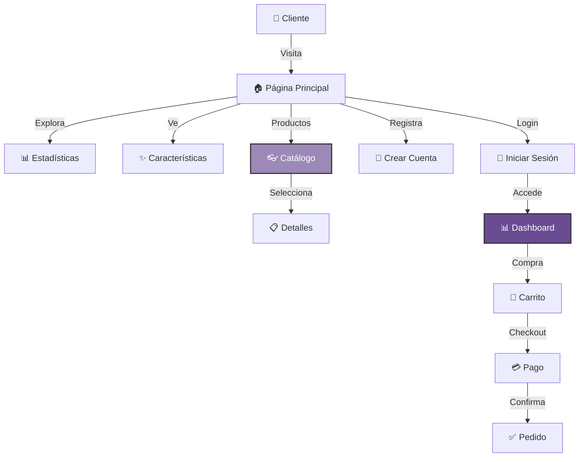
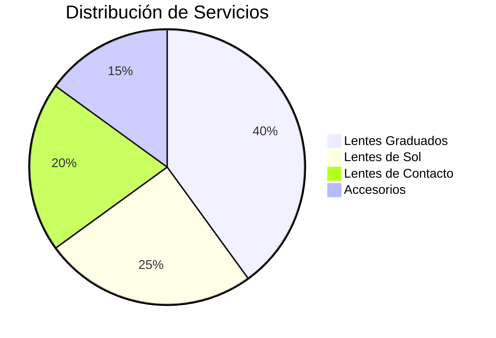

<table>
  <tr>
    <td width="150">
      <h1 style="font-size: 80px; margin: 0;">👓</h1>
    </td>
    <td>
      <h1>Óptica Visión</h1>
      <em>"Tu vista es nuestra prioridad"</em>
    </td>
  </tr>
</table>


## 💡 Sobre Óptica Visión

**Óptica Visión** es una tienda en línea especializada en lentes, monturas y servicios ópticos. Con más de 15 años de experiencia simulados, ofrece productos de las mejores marcas como Ray-Ban, Oakley, Gucci y más.

### ✨ Características Principales

* **Catálogo de Productos** - Lentes graduados, de sol y contacto
* **Animaciones Dinámicas** - Efectos visuales atractivos
* **Estadísticas en Vivo** - Contadores animados
* **Marcas Premium** - Ray-Ban, Oakley, Gucci, Tom Ford

### 🔄 Experiencia del Cliente



---

## ✨ Características Destacadas

| ⚡ Funcionalidad | 📌 Detalle |
|-----------------|-----------|
| **Exámenes Profesionales** | Equipos de última tecnología |
| **Amplio Catálogo** | Lentes, monturas y accesorios |
| **Servicio Rápido** | Pedidos listos en 24-48 horas |
| **Calidad Premium** | Materiales de alta calidad |
| **Precios Justos** | Mejores precios del mercado |
| **Atención Personalizada** | Asesoría especializada |

---

## 🎨 Badges & Estado


---

## ⚙️ Instalación y Configuración

### 1️⃣ Clonar el Repositorio

```bash
git clone https://github.com/JoseEduardoGR/Optica-Vision.git
cd Optica-Vision
```

### 2️⃣ Configurar Base de Datos

```sql
CREATE DATABASE optica_vision;
USE optica_vision;
-- Importar esquema desde config/
```

### 3️⃣ Configurar Conexión

Edita `config/session.php` con tus credenciales:

```php
$host = "localhost";
$db_name = "optica_vision";
$username = "tu_usuario";
$password = "tu_password";
```

### 4️⃣ Iniciar Servidor

```bash
php -S localhost:8000
```

Abre `http://localhost:8000` en tu navegador.

---

## 📂 Estructura del Proyecto

```
OPTICA-VISION/
├── assets/
│   ├── css/
│   │   └── style.css        # Estilos principales
│   └── js/
│       └── script.js        # Scripts del frontend
├── classes/
│   └── Car.php              # Clase de productos
├── config/
│   ├── database.php         # Conexión a BD
│   └── session.php          # Manejo de sesiones
├── scripts/                 # Scripts adicionales
├── dashboard.php            # Panel de usuario
├── index.php                # Página principal
├── login.php                # Inicio de sesión
├── logout.php               # Cerrar sesión
├── register.php             # Registro
├── LICENSE                  # Licencia MIT
└── README.md                # Este archivo
```

---

## 👓 Categorías de Productos

| Categoría | Descripción |
|-----------|-------------|
| **Lentes Graduados** | Para miopía, hipermetropía, astigmatismo |
| **Lentes de Sol** | Protección UV con estilo |
| **Lentes de Contacto** | Diarios, mensuales, de colores |
| **Monturas** | Diversas marcas y estilos |
| **Accesorios** | Estuches, limpiadores, cadenas |

---

## 🏷️ Marcas Disponibles

<div align="center">

| Ray-Ban | Oakley | Gucci | Persol | Tom Ford |
|:-------:|:------:|:-----:|:------:|:--------:|
| ⭐ | ⭐ | ⭐ | ⭐ | ⭐ |

</div>

---

## 📊 Estadísticas



---

## 🛠️ Tecnologías Utilizadas

| Tecnología | Uso |
|------------|-----|
| **PHP 8+** | Backend y lógica |
| **MySQL** | Base de datos |
| **CSS3** | Diseño con gradientes y animaciones |
| **JavaScript** | Efectos y contadores |

---

## 🏆 Créditos

**JoseEduardoGR** – Desarrollo y diseño.

💻 Proyecto educativo de preparatoria.

---

## 📄 Licencia

Este proyecto está bajo la **Licencia MIT** - ver el archivo [LICENSE](LICENSE) para más detalles.

---

<div align="center">
  <p>👓 Hecho con ❤️ por <a href="https://github.com/JoseEduardoGR">JoseEduardoGR</a></p>
  <p>Tu vista es nuestra prioridad</p>
</div>
